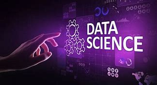

# 1. Projeto Ciência de Dados

Este repositório tem como objetivo centralizar e organizar todo o conhecimento em **Ciência de Dados** que venho acumulando ao longo da minha carreira. Aqui, você encontrará materiais estruturados sobre estatística, machine learning, engenharia de machine learning e outras áreas essenciais para o desenvolvimento de soluções baseadas em dados.

O conteúdo é disponibilizado de forma didática, contemplando desde conceitos fundamentais até técnicas avançadas, com exemplos práticos e referências para aprofundamento. Este projeto está em constante evolução, refletindo meu compromisso com aprendizado contínuo e compartilhamento de conhecimento.

**Autor**

- Email: espedito.ferreira.alves@outlook.com
- Linkdin: [Espedito Ferreira Alves](https://www.linkedin.com/in/espedito-ferreira-alves/)
- GitHub: [espeditoalves](https://github.com/espeditoalves)

---

# 2. Organização do Repositório

## 2.1. Sumário
O repositório está organizado nos seguintes capítulos:

- 📊 [**1. Estatística**](./1_estatistica/Introducao_estatistica.md)

Introdução à Estatística (Conceitos básicos, distribuições, testes de hipóteses e análise exploratória de dados)

- 🤖 [**2. Machine Learning**](./2_machine_learning/Introducao_machine_learning.md)

Em construção (Abordagem supervisionada/não supervisionada, modelos de classificação e regressão, avaliação de desempenho)

- ⚙️ [**3. Machine Learning Engineer**]()

Em construção (Deploy de modelos, pipelines de dados, monitoramento e escalabilidade em produção)

---

**Objetivo**

Servir como um repositório de conhecimento pessoal, podendo ser utilizado como referência para profissionais de dados, estudantes e entusiastas, combinando teoria e prática em um formato acessível.

Mapeamento de assuntos sobre ciencia de dados

<!-- Isto é um comentário e não será exibido na renderização final do Markdown 

## Estrutura do Diretório
Os diretórios estão organizados da seguinte forma:
- `/datasets`: Conjuntos de dados para análise e machine learning.
- `/notebooks`: Notebooks Jupyter com tutoriais e exemplos práticos.
- `/scripts`: Scripts Python para processamento de dados e análises estatísticas.
- `/docs`: Documentação e guias de referência.
-->

---

## 2.2. PROFISSIONAL BÁSICO - CIÊNCIA DE DADOS

## 2.3. I - MATEMÁTICA: 
### 2.3.1. Cálculo Básico: 
- funções; 
- limites; 
- derivadas; 
- derivadas parciais; 
- máximos e mínimos; integrais.  
### 2.3.2. Álgebra Linear: 
- vetores e matrizes; 
- operações com vetores e matrizes; 
- tipos de matrizes; 
- transformações lineares; 
- espaços e subespaços vetoriais de Rn; 
- sistemas de equações lineares; 
- normas (L1, L2, infinita, p-generalizada, Minkowksi e Chebyshev), autovalores e autovetores; 
- decomposição matricial (Cholesky e Singular Value Decomposition (SVD)). 
### 2.3.3. Otimização Matemática: 
- programação linear inteira e mista; 
- problemas de otimização unidimensionais e multidimensionais, com e sem restrições; 
- otimização convexa; 
- programação dinâmica. 

---
## 2.4. II - PROBABILIDADE E ESTATÍSTICA: 
### 2.4.1. Fundamentos de probabilidade: 
- definições básicas de probabilidade; 
- axiomas; 
- probabilidade condicional. 
### 2.4.2. Variáveis aleatórias e distribuições de probabilidades: 
- variáveis aleatórias; 
- funções de probabilidade; 
- principais distribuições discretas e contínuas (Uniforme, Binomial, Normal, Poisson, Bernoulli e Exponencial). 
### 2.4.3. Estatísticas Descritivas: 
- medidas de tendência central (média, mediana e moda);
- medidas de dispersão (variância, desvio padrão e amplitude); 
- medidas de posição (percentis e quartis). 
### 2.4.4. Teoremas fundamentais da probabilidade: 
- independência de eventos; 
- teorema de Bayes; 
- teorema da probabilidade total; 
- lei dos grandes números; 
- teorema central do limite. 
### 2.4.5. Distribuições amostrais: 
- distribuição amostral da média; 
- distribuição amostral da proporção; 
- distribuição qui-quadrado; 
- distribuição t de Student; 
- distribuição F. 
### 2.4.6. Inferência estatística: 
- estimação pontual e intervalar; 
- intervalos de confiança; 
- testes de hipóteses (formulação, tipos de erros, e poder do teste); 
- testes z e t para médias; 
- testes de proporções; 
- testes qui-quadrado para independência e ajuste de Goodness-of-Fit; 
- teste A/B. 
### 2.4.7. Correlação: 
- correlação e causalidade; 
- correlação de Pearson; 
- correlação de Spearman; 
- correlação parcial. 
### 2.4.8. Inferência Bayesiana: 
- distribuições a priori e a posteriori; 
- estimativa pontual e intervalar; 
- predição e testes de hipóteses bayesianos; 
- critérios de seleção de modelos; 
- métodos MCMC.

---
## 2.5. III - FINANÇAS QUANTITATIVAS:

### 2.5.1. Matemática financeira: 
- Convenções de Cálculo de Juros; 
- Valor Presente Líquido; 
- Taxa Interna de Retorno; 
- projeção de fluxos de caixa futuros. 
### 2.5.2. Mercados de Taxas de Juros: 
- Instrumentos de Renda Fixa; 
- Taxa Spot; 
- Taxa Foward; 
- Relações Básicas de Não Arbitragem no Mercado de Juros;
- Curvas de Juros; 
- Bootstraping de Curvas de Juros; 
- Duration; 
- Convexidade; 
- técnicas de interpolação de taxas de juros; 
- modelos de Svenson e de Nelson-Siegel. 
### 2.5.3. Medidas de Desempenho e de Riscos: 
- Volatilidade; 
- Value At Risk; 
- Conditional Value at Risk; 
- Backtesting de Modelos de Risco; 
- Maximum Drawdown; 
- Sharpe Ratio; 
- Information Ratio. 

### 2.5.4. Otimização de carteiras: 
- modelo de média-variância com e sem restrições; 
- modelos de paridade de riscos; 
- modelos de paridade de riscos hierárquica (HRP). 
### 2.5.5. Simulação de Monte Carlo em Finanças: 
- principais aplicações em precificação e análise de riscos.
### 2.5.6. Derivativos: 
- conceitos gerais; 
- derivativos de renda variável; 
- derivativos de renda fixa; 
- modelo de Black-Scholes. 

---
## 2.6. IV- DADOS E BASES DE DADOS:
### 2.6.1. Conceitos fundamentais de dados: 
- o que são dados; 
- processos geradores de dados; 
- tipos e classes de dados; 
- formatos de arquivos de dados comuns (txt, csv, xlsx, xml, json e parquet). 
### 2.6.2. Introdução a Bases de Dados: 
- o que são bases de dados; 
- tipos de bases de dados; 
- metadados; 
- tidy data. 
### 2.6.3. Introdução ao armazenamento de dados: 
- armazenamento de arquivos; 
- principais estruturas de armazenamento de dados analíticos (data warehouse, data mart, data lake data lakehouse, vector stores), suas diferenças conceituais e casos de uso;
- armazenamento na nuvem. 
### 2.6.4. Sistemas Gerenciadores de Base de Dados (SGBD):
- definição de SGBD; 
- principais funções; 
- principais tipos de SGBDs (SQL e NoSQL) e suas diferenças; transações e índices.
### 2.6.5. 5.Modelo de dados: 
- modelo de entidade-relacionamento (ER); 
- modelo relacional:
  - tabelas, 
  - esquemas, 
  - chaves, 
- consultas; 
- dados estruturados, semiestruturados e não estruturados;
- modelo chave-valor; 
- modelo colunar; 
- modelo orientado a documentos; 
- modelo orientado a grafos. 
### 2.6.6. Ingestão e armazenamento de dados; 
- definição de ingestão em lote (batch) e em tempo real (stream). 
### 2.6.7. Big Data: 
- conceito de big data; 
- conceitos gerais sobre técnicas e ferramentas para lidar com grandes volumes de dados (Spark, Hadoop, HDFS e MapReduce). 

---
## 2.7. V - GESTÃO DE PROJETOS DE CIÊNCIA DE DADOS: 
### 2.7.1. Ciclo de vida de projetos de ciência de dados. 
### 2.7.2. Metodologias de gestão de projetos de ciência de dados: 
- CRISP-DM; 
- Microsoft Team Data Science Process (TDSP); 
- princípios de métodos ágeis (Scrum/Kanban); 
- fundamentos de design thinking. 
### 2.7.3. Principais papéis envolvidos em projetos de ciência de dados. 
---
## 2.8. VI - QUALIDADE E PREPARAÇÃO DE DADOS: 
### 2.8.1. Metadados: 
- a sua importância para avaliação da qualidade de dados; 
- linhagem de dados; 
### 2.8.2. Coleta de dados: 
- fontes comuns de dados (internas e externas); 
- interface de programação de aplicação (API); 
- técnicas de web scraping. 
### 2.8.3. Problemas comuns de qualidade de dados: 
- valores ausentes; 
- duplicatas; 
- outliers; 
- desbalanceamento; 
- erros de imputação. 
### 2.8.4. Preparação de dados: 
- técnicas de tratamento e limpeza de dados; 
- técnicas detecção de vieses; 
- data profiling. 
### 2.8.5. Pré-processamento de dados: 
- técnicas de normalização e padronização; 
- discretização; 
- metodologias de codificação de variáveis categóricas (encoding). 
### 2.8.6. Feature engineering: 
- processos para enriquecimento de dados, com criação e seleção de features relevantes; 
- transformações matemáticas e estatísticas comuns em variáveis. 
### 2.8.7. Divisão de dados: 
- técnicas de amostragem; 
- divisão entre treinamento, validação e teste; 
- abordagens para cross-validation.

---
## 2.9. VII - MODELAGEM: 
### 2.9.1. Pipeline de treinamento de modelos e suas etapas. 
### 2.9.2. Otimização de hiperparâmetros: 
- grid search; 
- random search; 
- algoritmos de otimização avançados; 
- automl; 
- autotuning; 
- autofeature engineering. 
### 2.9.3. Métricas para avaliação e seleção de modelos:
- métricas para regressão (MSE; RMSE; MAE; R²; R² ajustado);
- métricas para classificação (accuracy, precision, recall, F1-score e ROC-AUC); 
- análise de matriz de confusão; 
- trade-off entre viés e variância; 
- detecção de overfitting e underfitting. 
### 2.9.4. Técnicas de regularização: 
- lasso; 
- ridge; 
- elastic net; 
- dropout; 
- early stopping; 
- batch normalization. 
### 2.9.5. Dados desbalanceados: 
- técnicas para lidar com dados desbalanceados;
- oversampling; 
- undersampling; 
- dados sintéticos; 
- ajuste de pesos. 
### 2.9.6. Validação de Modelos: 
- K-fold cross-validation; 
- leave-one-out cross-validation; 
- bootstrap. 
### 2.9.7. Modelagem de IA centrada em dados (data-centric). 
### 2.9.8. Interpretabilidade de modelos: 
- feature importance; 
- valores de Shapley (SHAP) e LIME. 
### 2.9.9. Implantação de modelos em produção: 
- exportação de modelos (pickle, PMML e ONNX); 
- modelos como serviço (APIs; microsserviços); 
- integração com sistemas existentes; 
- APIs e serviços web; 
- conceitos de MLOps; 
- implantação local (on premise) e na nuvem. 
### 2.9.10. Monitoramento de modelos: 
- monitoramento de desempenho; 
- data drift; 
- concept drift; 
- detecção de drifts; 
- retreino e atualização de modelos. 

---
## 2.10. VIII - CLASSES DE MODELOS: 
### 2.10.1. Redução de dimensionalidade: 
- Principal Component Analysis (PCA); 
- LDA; 
- ICA; 
- T-SNE; 
- uso de autoencoders. 
### 2.10.2. Técnicas de clusterização: 
- K-Means; 
- agrupamento hierárquico; 
- Gaussian Mixture Models; 
- DBSCAN. 
### 2.10.3. Técnicas de classificação: 
- Regressão logística; 
- K-Nearest Neighbors (KNN); 
- Suport Vector Machines (SVM); 
- Decision Trees (CART); 
- classificadores Naive-Bayes (Binomial-Beta, Poisson-Gama, Normal-Normal); 
- Florestas Aleatórias (Random Forest). 
### 2.10.4. Introdução à regressão: 
- regressão linear simples e múltipla; 
- hipóteses clássicas, método dos mínimos quadrados, diagnóstico e avaliação de modelos de regressão (F-test, coeficiente de determinação, análise de resíduos e demais), testes de significância, intervalos de confiança, análise ANOVA, modelos não lineares (log-log, lin-log, log-lin e inverso). 
### 2.10.5. Ensembling de modelos: 
- Bagging; 
- boosting (AdaBoost, Gradient Boosting, XGBoost, LightGBM e CatBoost); 
- stacking. 
### 2.10.6. Sistemas de recomendação: 
- Filtragem colaborativa (baseadas em usuários ou itens);
- filtragem baseada em conteúdo; sistemas híbridos;
- problemas comuns (cold start, escalabilidade, data sparsity). 
### 2.10.7. Modelos de séries temporais: 
- definição; 
- componentes (tendência, sazonalidade, ciclos e ruído);
- autocorrelação e autocorrelação parcial; 
- conceito e testes de estacionaridade; 
- cointegração; 
- modelos AR, ARMA e ARIMA; 
- modelos de suavização exponencial; 
- modelos de decomposição; 
- modelos de regressão com variáveis temporais (ARIMAX). 
### 2.10.8. Tópicos em regressão: 
- modelos de dados em painel; 
- GLM; 
- regressão espacial; 
- regressão quantílica; 
- regressão de Poisson; 
- modelos VAR; 
- ECM e GARCH. 
### 2.10.9. Introdução a modelos causais: 
- fundamentos de causalidade estatística, experimentos e quase-experimentos, desenho de descontinuidade de regressão, modelos de variáveis instrumentais, diferenças em diferenças, modelos de equações estruturais (SEM), métodos de pareamento.
### 2.10.10. Redes neurais: 
- Introdução a Redes Neurais Artificiais (arquitetura, funções de ativação, treinamento, forward pass, backpropagation, loss functions, algoritmos de otimização, épocas, batch size e demais); 
- embeddings; 
- redes profundas (deep learning); 
- Redes Neurais Convolucionais (CNNs) e Recorrentes (RNNs);
- LSTM; 
- GRU; 
- GAN; 
- modelos multimodais. 
### 2.10.11. Modelos de aprendizado por reforço: 
- Q-Learning; 
- Deep Q-Networks (DQN); 
- Policy Gradient Methods; 
- multi-armed bandit. 
### 2.10.12. Visão Computacional: 
- técnicas de pré-processamento de imagem; 
- OCR; 
- segmentação e extração de características de imagens;
- detecção; 
- segmentação e reconhecimento de objetos; 
- classificação de imagens. 
### 2.10.13. Modelos multi-modais: 
- principais aplicações. 
### 2.10.14. Quantificação de incertezas em modelos preditivos:
- Programação Probabilística; 
- Amostragem de Gibbs; 
- Inferência Variacional; 
- Hamiltonian Monte Carlo; 
- Modelos de Markov Ocultos; 
- Aprendizado Profundo Probabilístico; 
- Conformal Prediction. 
---

## 2.11. IX - PROCESSAMENTO DE LINGUAGEM NATURAL (NLP): 
### 2.11.1. Técnicas de pré-processamento de texto: 
- limpeza; 
- normalização; 
- remoção de stop words; 
- stemming; 
- lematização e demais. 
### 2.11.2. Representação de texto: 
- N-grams; 
- CBoW; 
- FTD-IDF; 
- word embeddings (Word2Vec, GloVe e demais) e document embeddings (Doc2Vec, BERT, ELMo e demais). 
### 2.11.3. Modelagem de tópicos: 
- latent dirichlet allocation (LDA); 
- non-negative matrix factorization (NMF). 
### 2.11.4. Modelos de linguagem: 
- modelos de linguagem tradicionais; 
- redes neurais recorrentes; 
- redes neurais convolucionais; 
- transformers. 
### 2.11.5. Tarefas básicas em NLP: 
- classificação de texto; 
- análise de sentimento; 
- extração de informação (NER; REL); 
- similaridade textual; 
- sumarização de texto; 
- rotulação de partes do discurso (POS-tagging) e tradução automática. 
### 2.11.6. Aplicações relacionadas a modelos de NLP: 
- geração de texto; 
- question answering e diálogo conversacional; 
- retrieval augmented generation (RAG); 
- chatbots; 
- extração estruturada de informações; 
- agentes de IA (IA agents). 

---
## 2.12. X - PROGRAMAÇÃO E FERRAMENTAS: 
### 2.12.1. Linguagem de programação Python: 
- sintaxe básica; 
- operadores; 
- variáveis; 
- estruturas de dados (dataframes, listas, matrizes, dicionários e conjuntos); 
- estruturas de controle de fluxo; 
- funções; 
- escopo; 
- método; 
- paralelização de rotinas; 
- serialização e desserialização. 
### 2.12.2. Bibliotecas Python: 
- Pandas (manipulação; limpeza; transformação e pré-processamento de dado); 
- NumPy (operações de arrays); 
- Matplotlib e Seaborn (visualização de dados); 
- TensorFlow; 
- Keras e PyTorch (redes neurais); 
- Scikit-learn e XGBoost (aprendizado de máquina); 
- NLTK e spaCy (processamento de linguagem natural);
- huggingface (LLM); 
- PySpark (Big data); 
- Beautiful Soup (web scraping); 
- Streamlit (data apps). 
### 2.12.3. Linguagem SQL (Structured Query Language): 
- conceitos introdutórios; 
- comandos básicos para consultas (inserção, atualização e exclusão de dados) e para análise de dados (como funções de agregação, filtros, joins, subconsultas e demais). 
### 2.12.4. Gestão de Código: 
- qualidade de código; 
- testes automatizados; 
- versionamento (Git). 
### 2.12.5. Ambientes de programação: 
- Jupyterhub e Jupyter Notebooks; 
- linha de comando (navegação em diretórios, manipulação de arquivos e dados);
- gerenciamento de processos; 
- configuração de ambientes e variáveis de ambiente;
- gerenciamento de pacotes Python (pip); 
- ambientes virtuais Python. 
### 2.12.6. Microsoft Power BI: 
- conexão e importação de dados; 
- modelagem de dados; 
- criação de medidas e colunas calculadas; 
- visualizações e gráficos; 
- interações entre visualizações; 
- criação de relatórios e painéis. 
---

## 2.13. XI - VISUALIZAÇÃO; 
- ### STORYTELLING E COMUNICAÇÃO CORPORATIVA: 
### 2.13.1. Principais tipos de visualizações e gráficos: 
- tabela; 
- gráfico de barras; 
- linhas; 
- pizza; 
- dispersão; 
- histograma; 
- área; 
- boxplot; 
- bolhas; 
- radar; 
- mapas cartográficos; 
- mapa de calor. 
### 2.13.2. Visualização de dados: 
- princípios de design de gráficos efetivos; 
- principais conceitos de codificação visual;
- interatividade; 
- acessibilidade em gráficos. 
### 2.13.3. Dashboards: 
- técnicas para construção de interfaces e layout;
- abordagens para escolha de designs; 
- organização de elementos visuais e gráficos; 
- seleção de gráficos e visualizações; 
- interatividades e drill-downs; 
- acessibilidade. 
### 2.13.4. Storytelling com dados: 
- construção de narrativas visuais e contextualizações;
- componentes de um storytelling efetivo. 
### 2.13.5. Reportes executivos: 
- princípios de comunicação corporativa; 
- interpretação e apresentação de dados de resultados de análises e de insights. 
---

## 2.14. XII - GOVERNANÇA E SEGURANÇA DE DADOS: 
### 2.14.1. Noções de governança de dados (DMBOK): 
- conceitos e objetivos da governança de dados; 
- principais técnicas de qualidade e integridade de dados;
- princípios de privacidade e proteção a dados. 

---
## 2.15. XIII - GOVERNANÇA, SEGURANÇA E APLICAÇÃO RESPONSÁVEL DE IA: 
### 2.15.1. Noções de governança de IA: 
- conceitos e objetivos da governança de IA; 
- gestão de riscos em IA; 
- gestão de ciclo de vida de modelos. 
### 2.15.2. Principais riscos e vulnerabilidades relacionados a IA: 
- viés algorítmico; 
- exposição de dados sensíveis; 
- envenenamento de dados de treinamento; 
- ataques adversariais; 
- ataques de manipulação de modelos; 
- roubo de modelos; 
- ataque de inferência; 
- alucinações. 
### 2.15.3. Aplicação de IA responsável: 
- definição; 
- ética; 
- transparência; 
- justiça e equidade; 
- responsabilização; 
- segurança cibernética; 
- compliance regulatório.
---